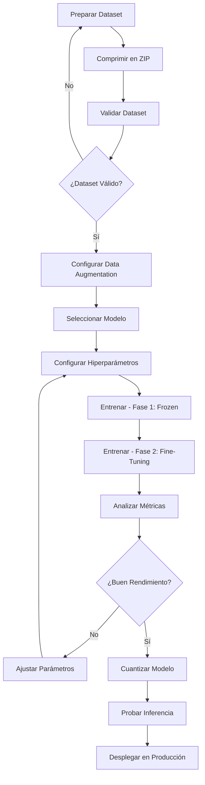

# Rachael Classifier TF

**Plataforma Profesional de Machine Learning para Entrenamiento de Clasificadores de Imágenes**

Una aplicación completa basada en TensorFlow para entrenar, optimizar y desplegar modelos de clasificación de imágenes con arquitecturas state-of-the-art como EfficientNet, ResNet y MobileNet.

---

## Características Principales

- **13 Arquitecturas Pre-entrenadas**: ResNet (18/50/101/152), EfficientNet (B0-B3), EfficientNetV2 (B0-B3), MobileNet (V1/V2)
- **Transfer Learning Avanzado**: Estrategia de entrenamiento en dos fases (frozen + fine-tuning)
- **Data Augmentation Configurable**: Rotación, traslación, zoom, brillo, volteo
- **Validación de Dataset**: Verificación automática de estructura y calidad de datos
- **Visualización de Métricas**: Gráficas de precisión/pérdida, matriz de confusión
- **Cuantización TFLite**: Exporta modelos optimizados (Float32, Float16, Int8)
- **Interfaz Web Intuitiva**: UI basada en Gradio con soporte bilingüe (ES/EN)
- **GPU/CPU Compatible**: Detección automática de hardware disponible
- **Docker Ready**: Despliegue con un solo comando

---

## Tabla de Contenidos

- [Requisitos](#requisitos)
- [Instalación](#instalación)
  - [Método 1: Launcher Automático (Recomendado)](#método-1-launcher-automático-recomendado)
  - [Método 2: Docker Compose Manual](#método-2-docker-compose-manual)
  - [Método 3: Instalación Local (sin Docker)](#método-3-instalación-local-sin-docker)
- [Inicio Rápido](#inicio-rápido)
- [Flujo de Trabajo Completo](#flujo-de-trabajo-completo)
- [Arquitecturas Soportadas](#arquitecturas-soportadas)
- [Estructura de Dataset](#estructura-de-dataset)
- [Data Augmentation](#data-augmentation)
- [Proceso de Entrenamiento](#proceso-de-entrenamiento)
- [Cuantización y Optimización](#cuantización-y-optimización)
- [Inferencia](#inferencia)
- [Estructura de Archivos Generados](#estructura-de-archivos-generados)
- [Configuración Avanzada](#configuración-avanzada)
- [Resolución de Problemas](#resolución-de-problemas)
- [Licencia](#licencia)

---

## Requisitos

### Hardware
- **CPU**: Procesador multi-core moderno (recomendado 4+ cores)
- **RAM**: Mínimo 8GB (recomendado 16GB+)
- **GPU** (opcional): NVIDIA con soporte CUDA para aceleración
- **Almacenamiento**: 10GB+ de espacio libre

### Software
- **Docker**: 20.10+ y Docker Compose 1.29+ / Docker Compose V2
- **Sistema Operativo**: Linux (recomendado), macOS, Windows con WSL2
- **Python**: 3.8+ (solo para instalación local)
- **NVIDIA Docker Runtime** (opcional, para GPU): `nvidia-docker2`

---

## Instalación

### Método 1: Launcher Automático (Recomendado)

El método más rápido para iniciar la aplicación:

```bash
# Clonar el repositorio
git clone https://github.com/tu-usuario/rachael-classifier-tf.git
cd rachael-classifier-tf

# Lanzar la aplicación (crea directorios, inicia Docker, abre navegador)
python3 launch.py
```

**Comandos del Launcher:**
```bash
python3 launch.py          # Iniciar aplicación
python3 launch.py stop     # Detener aplicación
python3 launch.py restart  # Reiniciar aplicación
python3 launch.py help     # Mostrar ayuda
```

### Método 2: Docker Compose Manual

Para usuarios que prefieren control total:

```bash
# Clonar repositorio
git clone https://github.com/tu-usuario/rachael-classifier-tf.git
cd rachael-classifier-tf

# Crear directorios necesarios
mkdir -p models data logs

# Iniciar con CPU
docker compose up -d

# O iniciar con GPU (requiere NVIDIA Docker Runtime)
DOCKER_RUNTIME=nvidia docker compose up -d

# Ver logs
docker compose logs -f

# Detener
docker compose down
```

### Método 3: Instalación Local (sin Docker)

Para desarrollo o entornos sin Docker:

```bash
# Clonar repositorio
git clone https://github.com/tu-usuario/rachael-classifier-tf.git
cd rachael-classifier-tf

# Crear entorno virtual
python3 -m venv venv
source venv/bin/activate  # En Windows: venv\Scripts\activate

# Instalar TensorFlow (GPU o CPU)
# GPU (requiere CUDA 11.2+)
pip install tensorflow-gpu==2.9.1

# CPU
pip install tensorflow==2.9.1

# Instalar dependencias
pip install -r requirements.txt

# Crear directorios
mkdir -p models data logs

# Ejecutar aplicación
python3 training_app.py
```

**Acceder a la aplicación**: Abre tu navegador en `http://localhost:7860`

---

## Inicio Rápido

### 1. Preparar tu Dataset

Organiza tus imágenes en carpetas por clase:

```
mi_dataset/
├── clase_1/
│   ├── imagen1.jpg
│   ├── imagen2.jpg
│   └── ...
├── clase_2/
│   ├── imagen1.jpg
│   └── ...
└── clase_3/
    └── ...
```

Comprime el directorio en formato ZIP:
```bash
zip -r mi_dataset.zip mi_dataset/
```

### 2. Validar Dataset

1. Ve a la pestaña **"Validación de Dataset"**
2. Sube tu archivo ZIP
3. Haz clic en **"Validar Dataset"**
4. Revisa el informe de validación (clases detectadas, cantidad de imágenes, recomendaciones)

### 3. Configurar Data Augmentation (Opcional)

1. Ve a la pestaña **"Data Augmentation"**
2. Activa las transformaciones deseadas:
   - **Rotación**: Hasta 180 grados
   - **Traslación**: Desplazamiento X/Y
   - **Volteo**: Horizontal/Vertical
   - **Zoom**: Factor de zoom in/out
   - **Brillo**: Ajustes de iluminación
3. Haz clic en **"Preview Augmentation"** para visualizar ejemplos

### 4. Entrenar Modelo

1. Ve a la pestaña **"Entrenamiento"**
2. Selecciona un modelo (recomendado: **EfficientNetV2B0** para comenzar)
3. Configura parámetros:
   - **Épocas**: 20-50 (prueba con 20 primero)
   - **Batch Size**: Ajustado automáticamente según resolución
   - **Learning Rate**: Usa valores por defecto inicialmente
4. Haz clic en **"Entrenar Modelo"**
5. Monitorea el progreso en tiempo real

### 5. Ver Métricas

1. Ve a la pestaña **"Métricas y Visualización"**
2. Selecciona el modelo entrenado del dropdown
3. Analiza:
   - Curvas de precisión/pérdida
   - Matriz de confusión
   - Reporte de clasificación
   - Indicadores de overfitting

### 6. Optimizar para Producción (Opcional)

1. Ve a la pestaña **"Cuantización TFLite"**
2. Selecciona el modelo a optimizar
3. Elige el tipo de cuantización:
   - **Float32**: Sin compresión (máxima precisión)
   - **Float16**: Balance tamaño/precisión
   - **Int8**: Máxima compresión (ideal para móviles)
4. Haz clic en **"Cuantizar Modelo"**
5. Descarga los archivos `.tflite` generados

### 7. Probar el Modelo

1. Ve a la pestaña **"Inferencia"**
2. Sube imágenes de prueba
3. Selecciona el formato de modelo
4. Selecciona una imagen
5. Haz clic en **"Predict"**
6. Revisa las predicciones con scores de confianza

---

## Flujo de Trabajo Completo



---

## Arquitecturas Soportadas

| Modelo | Input Size | Parámetros | Uso Recomendado |
|--------|-----------|-----------|------------------|
| **MobileNet** | 224x224 | ~4M | Dispositivos móviles, bajo consumo |
| **MobileNetV2** | 224x224 | ~3.5M | Móviles/Edge, mejor precisión que V1 |
| **EfficientNetB0** | 224x224 | ~5M | Balance ideal precisión/velocidad |
| **EfficientNetB1** | 240x240 | ~7M | Más precisión que B0 |
| **EfficientNetB2** | 260x260 | ~9M | Alto rendimiento |
| **EfficientNetB3** | 300x300 | ~12M | Máxima precisión EfficientNet |
| **EfficientNetV2B0** | 224x224 | ~7M | Versión mejorada, recomendado |
| **EfficientNetV2B1** | 240x240 | ~8M | Mejor que EfficientNetB1 |
| **EfficientNetV2B2** | 260x260 | ~10M | Alto rendimiento V2 |
| **EfficientNetV2B3** | 300x300 | ~14M | Máxima precisión |
| **ResNet18** | 224x224 | ~11M | Rápido, sin pre-entrenamiento ImageNet |
| **ResNet50** | 224x224 | ~25M | Clásico, muy probado |
| **ResNet101** | 224x224 | ~44M | Datasets complejos |
| **ResNet152** | 224x224 | ~60M | Máxima capacidad |

**Recomendaciones:**
- **Comenzar con**: EfficientNetV2B0 (mejor balance)
- **Producción móvil**: MobileNetV2 + cuantización Int8
- **Máxima precisión**: EfficientNetV2B3 o ResNet152
- **Bajo recursos**: MobileNet + Float16

---

## Estructura de Dataset

### Formato Requerido

```
dataset_name/
├── clase_1/           # Nombre de la primera clase
│   ├── img_001.jpg
│   ├── img_002.jpg
│   ├── img_003.png
│   └── ...           # Mínimo 50+ imágenes (recomendado 100+)
│
├── clase_2/           # Nombre de la segunda clase
│   ├── photo_a.jpg
│   ├── photo_b.jpg
│   └── ...
│
└── clase_n/           # N clases soportadas
    └── ...
```

### Requisitos
- **Formatos soportados**: JPG, JPEG, PNG, BMP, GIF
- **Mínimo 2 clases** requeridas
- **Mínimo 50 imágenes por clase** (recomendado 100+)
- **Split automático**: 80% entrenamiento, 20% validación
- **Nombres de carpetas**: Se usan como nombres de clase

### Recomendaciones
- **Balance de clases**: Intenta tener cantidades similares de imágenes por clase
- **Calidad**: Imágenes claras, bien iluminadas, sin mucho ruido
- **Variedad**: Incluye diferentes ángulos, iluminaciones, fondos
- **Resolución**: Mínimo 224x224px (se redimensionan automáticamente)

---

## Data Augmentation

### Transformaciones Disponibles

#### 1. Rotación
- **Rango**: 0-180 grados
- **Uso**: Mejora invariancia a orientación
- **Recomendado**: 15-30 grados para objetos naturales

#### 2. Traslación
- **Traslación X**: Desplazamiento horizontal (0-100%)
- **Traslación Y**: Desplazamiento vertical (0-100%)
- **Uso**: Ayuda con objetos descentrados
- **Recomendado**: 10-20% para datasets generales

#### 3. Volteo (Flip)
- **Horizontal**: Espejo izquierda-derecha
- **Vertical**: Espejo arriba-abajo
- **Uso**: Duplica datos sintéticamente
- **Recomendado**: Horizontal casi siempre, vertical según el caso

#### 4. Zoom
- **Rango**: 0-100% (zoom in/out)
- **Uso**: Simula diferentes distancias de captura
- **Recomendado**: 10-20% para variabilidad de escala

#### 5. Brillo
- **Brighten**: Incrementa luminosidad (0-100%)
- **Darken**: Reduce luminosidad (0-100%)
- **Uso**: Robustez a condiciones de iluminación
- **Recomendado**: 20-30% para ambientes variables

### Estrategias Recomendadas

**Dataset Pequeño (<500 imágenes por clase)**
```yaml
Rotación: 20-30 grados
Traslación: 15-20%
Volteo Horizontal: Activado
Zoom: 15-20%
Brillo: 25-30%
```

**Dataset Mediano (500-2000 imágenes por clase)**
```yaml
Rotación: 10-15 grados
Traslación: 10-15%
Volteo Horizontal: Activado
Zoom: 10-15%
Brillo: 15-20%
```

**Dataset Grande (>2000 imágenes por clase)**
```yaml
Rotación: 5-10 grados
Traslación: 5-10%
Volteo Horizontal: Según dominio
Zoom: 5-10%
Brillo: 10-15%
```

---

## Proceso de Entrenamiento

### Estrategia de Dos Fases

#### Fase 1: Frozen Training (66% de épocas)
```python
# Configuración automática
- Capas base: Congeladas (pesos ImageNet)
- Cabeza clasificadora: Entrenable
- Learning Rate: 0.01 (alto)
- Objetivo: Adaptar clasificador a nuevas clases
```

**Ventajas:**
- Entrenamiento rápido
- Previene overfitting inicial
- Aprovecha features pre-entrenadas

#### Fase 2: Fine-Tuning (34% de épocas)
```python
# Configuración automática
- Últimas 20 capas: Descongeladas
- Batch Normalization: Congelada
- Learning Rate: 0.0001 (bajo)
- Objetivo: Afinar features a dataset específico
```

**Ventajas:**
- Mejora precisión final
- Adapta features pre-entrenadas
- Evita forgetting catastrófico

### Hiperparámetros

| Parámetro | Por Defecto | Rango Recomendado | Descripción |
|-----------|-------------|-------------------|-------------|
| **Épocas** | 30 | 20-100 | Iteraciones completas sobre dataset |
| **Batch Size** | Auto | 16-64 | Ajustado según resolución |
| **LR Frozen** | 0.01 | 0.001-0.1 | Learning rate fase 1 |
| **LR Unfrozen** | 0.0001 | 0.00001-0.001 | Learning rate fase 2 |
| **Dropout** | 0.2 | 0.1-0.5 | Regularización en cabeza |

### Batch Size Automático

```python
if input_size <= 224:
    batch_size = 64
elif input_size <= 350:
    batch_size = 32
elif input_size <= 456:
    batch_size = 16
else:
    batch_size = 8
```

### Monitoreo en Tiempo Real

Durante el entrenamiento se muestra:
- Epoch actual / Total
- Precisión de entrenamiento
- Precisión de validación
- Pérdida (loss)
- Tiempo estimado restante
- Fase actual (Frozen/Fine-Tuning)

---

## Cuantización y Optimización

### Tipos de Cuantización

#### 1. Float32 (Sin Cuantización)
```yaml
Tamaño: 100% (referencia)
Precisión: 100%
Uso: Servidor, GPU
Compatibilidad: Total
```

#### 2. Float16 (Cuantización de Rango Dinámico)
```yaml
Tamaño: ~50% del original
Precisión: ~99.9%
Uso: Edge devices, GPU
Ventajas: Balance ideal tamaño/precisión
```

#### 3. Int8 (Cuantización Entera Completa)
```yaml
Tamaño: ~25% del original
Precisión: ~98-99%
Uso: Móviles, microcontroladores
Ventajas: Máxima compresión, inferencia rápida
```

### Comparación de Tamaños Típicos

| Modelo | SavedModel | Float32 | Float16 | Int8 |
|--------|-----------|---------|---------|------|
| MobileNetV2 | ~14MB | ~14MB | ~7MB | ~3.5MB |
| EfficientNetB0 | ~29MB | ~29MB | ~14.5MB | ~7MB |
| EfficientNetV2B0 | ~44MB | ~44MB | ~22MB | ~11MB |
| ResNet50 | ~98MB | ~98MB | ~49MB | ~24MB |

### Uso de Modelos TFLite

#### Python
```python
import tensorflow as tf
import numpy as np
from PIL import Image

# Cargar modelo
interpreter = tf.lite.Interpreter(model_path="model_int8.tflite")
interpreter.allocate_tensors()

# Obtener detalles de input/output
input_details = interpreter.get_input_details()
output_details = interpreter.get_output_details()

# Preparar imagen
img = Image.open("test.jpg").resize((224, 224))
img_array = np.array(img, dtype=np.float32) / 255.0
img_array = np.expand_dims(img_array, axis=0)

# Inferencia
interpreter.set_tensor(input_details[0]['index'], img_array)
interpreter.invoke()
predictions = interpreter.get_tensor(output_details[0]['index'])

print(f"Predicción: {np.argmax(predictions)}")
```

#### Android (Kotlin)
```kotlin
import org.tensorflow.lite.Interpreter
import java.nio.ByteBuffer

val tfliteModel = loadModelFile("model_int8.tflite")
val interpreter = Interpreter(tfliteModel)

val inputBuffer: ByteBuffer = preprocessImage(bitmap)
val outputBuffer = Array(1) { FloatArray(NUM_CLASSES) }

interpreter.run(inputBuffer, outputBuffer)
val prediction = outputBuffer[0].indices.maxByOrNull { outputBuffer[0][it] }
```

---

## Inferencia

### Formatos de Modelo Soportados

1. **SavedModel** (TensorFlow nativo)
   - Mejor precisión
   - Uso en servidor/GPU
   - Compatible con TensorFlow Serving

2. **TFLite Float32**
   - Sin pérdida de precisión
   - Para dispositivos edge

3. **TFLite Float16**
   - Balance tamaño/precisión
   - Recomendado para producción móvil

4. **TFLite Int8**
   - Máxima compresión
   - Ideal para dispositivos limitados

### Interpretación de Resultados

```
Clase: perro
Confianza: 0.95 (95%)

Clase: gato
Confianza: 0.03 (3%)

Clase: pájaro
Confianza: 0.02 (2%)
```

**Interpretación:**
- **>90%**: Predicción muy confiable
- **70-90%**: Predicción confiable
- **50-70%**: Predicción dudosa, revisar
- **<50%**: Baja confianza, posible error

---

## Estructura de Archivos Generados

### Durante el Entrenamiento

```
models/
└── EfficientNetV2B0_20251107_132826/
    ├── saved_model.tf/              # Modelo TensorFlow
    │   ├── assets/
    │   ├── variables/
    │   │   ├── variables.data-00000-of-00001
    │   │   └── variables.index
    │   └── saved_model.pb
    │
    ├── model.h5                     # Formato H5 (backup)
    ├── config.json                  # Configuración del modelo
    ├── training_history.json        # Métricas por época
    ├── training_plots.png           # Visualización de entrenamiento
    └── classes.txt                  # Lista de clases
```

### Después de Cuantización

```
models/
└── quantized_EfficientNetV2B0_20251107_132826/
    ├── EfficientNetV2B0_float32.tflite  # Sin cuantización
    ├── EfficientNetV2B0_float16.tflite  # Float16
    └── EfficientNetV2B0_int8.tflite     # Int8
```

### Archivo config.json

```json
{
  "model_name": "EfficientNetV2B0",
  "timestamp": "20251107_132826",
  "num_classes": 5,
  "class_names": ["clase_1", "clase_2", "clase_3", "clase_4", "clase_5"],
  "input_size": 224,
  "epochs": 30,
  "batch_size": 64,
  "learning_rate_frozen": 0.01,
  "learning_rate_unfrozen": 0.0001,
  "augmentation": {
    "rotation": 20,
    "translation_x": 0.1,
    "translation_y": 0.1,
    "zoom": 0.15,
    "horizontal_flip": true,
    "vertical_flip": false,
    "brightness": 0.2
  }
}
```

### Archivo training_history.json

```json
{
  "accuracy": [0.65, 0.78, 0.84, 0.89, 0.92, ...],
  "val_accuracy": [0.63, 0.75, 0.81, 0.86, 0.88, ...],
  "loss": [1.2, 0.8, 0.6, 0.4, 0.3, ...],
  "val_loss": [1.3, 0.9, 0.7, 0.5, 0.4, ...]
}
```

---

## Configuración Avanzada

### Variables de Entorno

```bash
# Docker Compose
DOCKER_RUNTIME=nvidia          # nvidia para GPU, runc para CPU
USER_ID=1000                   # ID de usuario (automático)
GROUP_ID=1000                  # ID de grupo (automático)
MEMORY_LIMIT=12G               # Límite de RAM
MEMORY_RESERVATION=4G          # RAM mínima reservada
NVIDIA_VISIBLE_DEVICES=all     # GPUs visibles (all, 0, 1, etc.)

# Aplicación
GRADIO_SERVER_NAME=0.0.0.0     # Host del servidor
GRADIO_SERVER_PORT=7860        # Puerto de la aplicación
TF_CPP_MIN_LOG_LEVEL=2         # Nivel de logging TensorFlow
TF_ENABLE_ONEDNN_OPTS=0        # Optimizaciones oneDNN
```

### Personalización de Puertos

Editar `docker-compose.yml`:
```yaml
ports:
  - "8080:7860"  # Cambiar 8080 por tu puerto preferido
```

### Uso Multi-GPU

```bash
# Configurar GPUs específicas
NVIDIA_VISIBLE_DEVICES=0,1 docker compose up -d

# Ver uso de GPU
docker exec rachael-classifier-tf nvidia-smi
```

### Límites de Memoria

Para datasets grandes o modelos pesados:
```bash
# Aumentar memoria disponible
MEMORY_LIMIT=20G MEMORY_RESERVATION=8G docker compose up -d
```

---

## Resolución de Problemas

### Problema: GPU no detectada

**Síntomas**: La aplicación usa CPU a pesar de tener GPU NVIDIA

**Soluciones**:
```bash
# 1. Verificar NVIDIA Docker Runtime
docker run --rm --gpus all nvidia/cuda:11.2.0-base nvidia-smi

# 2. Instalar nvidia-docker2
sudo apt-get install nvidia-docker2
sudo systemctl restart docker

# 3. Iniciar con runtime correcto
DOCKER_RUNTIME=nvidia docker compose up -d
```

### Problema: Error de memoria (OOM)

**Síntomas**: `ResourceExhaustedError` o contenedor se detiene

**Soluciones**:
1. Reducir batch size en configuración de entrenamiento
2. Usar modelo más pequeño (MobileNetV2 en lugar de ResNet152)
3. Aumentar límite de memoria Docker:
```bash
MEMORY_LIMIT=16G docker compose up -d
```

### Problema: Dataset no válido

**Síntomas**: "Invalid dataset structure" al validar

**Soluciones**:
- Verificar estructura de carpetas (una carpeta por clase)
- Asegurar mínimo 50 imágenes por clase
- Comprobar formatos de imagen (JPG, PNG, BMP)
- Eliminar archivos ocultos o metadatos (.DS_Store, Thumbs.db)

### Problema: Permisos denegados

**Síntomas**: Error al guardar modelo o acceder a archivos

**Soluciones**:
```bash
# Dar permisos correctos
sudo chown -R $USER:$USER models data logs
chmod -R 755 models data logs

# O usar el script de permisos
docker exec rachael-classifier-tf python -c "import os; from training_app import set_user_permissions; set_user_permissions('/workspace/models')"
```

### Problema: Overfitting detectado

**Síntomas**: Precisión train > val en más de 10%

**Soluciones**:
1. Aumentar data augmentation
2. Reducir número de épocas
3. Usar regularización (dropout ya está activado al 20%)
4. Agregar más datos de entrenamiento
5. Usar modelo más pequeño

### Problema: Modelo no converge

**Síntomas**: Precisión se mantiene baja (<50%) después de varias épocas

**Soluciones**:
1. Aumentar learning rate frozen (0.01 → 0.05)
2. Entrenar más épocas
3. Verificar calidad de dataset (etiquetas correctas)
4. Probar otro modelo base
5. Ajustar data augmentation (puede estar muy agresivo)

### Problema: Puerto 7860 en uso

**Síntomas**: Error al iniciar contenedor por puerto ocupado

**Soluciones**:
```bash
# Opción 1: Detener el servicio que usa el puerto
sudo lsof -i :7860
sudo kill -9 <PID>

# Opción 2: Cambiar puerto en docker-compose.yml
ports:
  - "8080:7860"
```

### Problema: Contenedor no inicia

**Síntomas**: Contenedor se detiene inmediatamente después de iniciar

**Soluciones**:
```bash
# Ver logs detallados
docker compose logs rachael-trainer

# Verificar recursos disponibles
docker stats

# Reconstruir imagen
docker compose down
docker compose build --no-cache
docker compose up -d
```

---

## Mejores Prácticas

### Dataset
- Mínimo 100 imágenes por clase (ideal 500+)
- Balance de clases (cantidades similares)
- Imágenes diversas (ángulos, iluminaciones, fondos)
- Calidad consistente

### Entrenamiento
- Comenzar con EfficientNetV2B0 para probar
- Usar data augmentation moderado inicialmente
- Monitorear métricas de validación constantemente
- Guardar checkpoints del mejor modelo

### Producción
- Cuantizar a Float16 para balance óptimo
- Usar Int8 solo en dispositivos muy limitados
- Probar modelo cuantizado antes de desplegar
- Mantener versión Float32 como referencia

---

## FAQ

**P: ¿Cuánto tiempo tarda el entrenamiento?**
R: Depende del dataset y hardware. Con GPU: 5-30 minutos. Con CPU: 30 minutos - 3 horas.

**P: ¿Puedo usar mis propios modelos pre-entrenados?**
R: Actualmente soporta modelos de Keras Applications. Para modelos personalizados, necesitarías modificar `training_app.py`.

**P: ¿Funciona sin GPU?**
R: Sí, detecta automáticamente el hardware y usa CPU si no hay GPU.

**P: ¿Cuánta RAM necesito?**
R: Mínimo 8GB, recomendado 16GB+ para modelos grandes.

**P: ¿Puedo exportar a otros formatos (ONNX, CoreML)?**
R: Actualmente exporta SavedModel y TFLite. Para ONNX/CoreML usa herramientas de conversión externas.

**P: ¿Soporta detección de objetos o segmentación?**
R: No, solo clasificación de imágenes. Para otras tareas se requeriría refactorización significativa.

**P: ¿Puedo usar Transfer Learning de mis propios modelos?**
R: Los modelos se entrenan desde arquitecturas pre-entrenadas en ImageNet. Para fine-tuning de modelos propios, carga el modelo en la pestaña de inferencia.

---

## Recursos Adicionales

### Documentación TensorFlow
- [TensorFlow API](https://www.tensorflow.org/api_docs/python/tf)
- [TFLite Guide](https://www.tensorflow.org/lite/guide)
- [Keras Applications](https://keras.io/api/applications/)

### Papers de Referencia
- [EfficientNet](https://arxiv.org/abs/1905.11946)
- [EfficientNetV2](https://arxiv.org/abs/2104.00298)
- [ResNet](https://arxiv.org/abs/1512.03385)
- [MobileNet](https://arxiv.org/abs/1704.04861)

### Datasets Públicos
- [ImageNet](https://www.image-net.org/)
- [CIFAR-10/100](https://www.cs.toronto.edu/~kriz/cifar.html)
- [Kaggle Datasets](https://www.kaggle.com/datasets)

---

## Contribuciones

Las contribuciones son bienvenidas! Por favor:

1. Fork el repositorio
2. Crea una rama para tu feature (`git checkout -b feature/AmazingFeature`)
3. Commit tus cambios (`git commit -m 'Add some AmazingFeature'`)
4. Push a la rama (`git push origin feature/AmazingFeature`)
5. Abre un Pull Request

---

## Licencia

Este proyecto está bajo la Licencia MIT. Ver archivo `LICENSE` para más detalles.

---

## Contacto

**Rachael Vision - Advanced AI Technology**

- GitHub: [@tu-usuario](https://github.com/tu-usuario)
- Email: tu-email@ejemplo.com
- Web: https://tu-sitio.com

---

## Changelog

### v2.0 - TensorFlow Edition (2024-11-07)
- Migración completa a TensorFlow 2.9.1
- 13 arquitecturas pre-entrenadas
- Interfaz Gradio mejorada
- Cuantización TFLite integrada
- Docker optimizado para GPU/CPU
- Sistema de validación de dataset
- Data augmentation avanzado

### v1.0 - Initial Release
- Versión inicial con PyTorch

---

**Made with by Rachael Vision**
